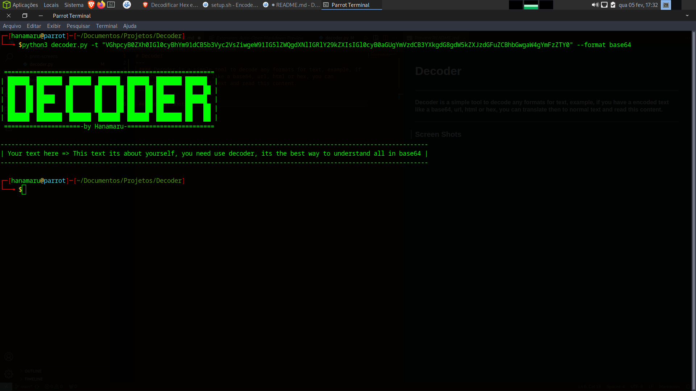

# Decoder - decoding all you need!
---
 #### Decoder is a simple tool to decode any formats for text, example, if you have a encoded text like a base64, url, html or hex, you can translate then to normal text and read this content.
 ---

 ### Screen Shots

